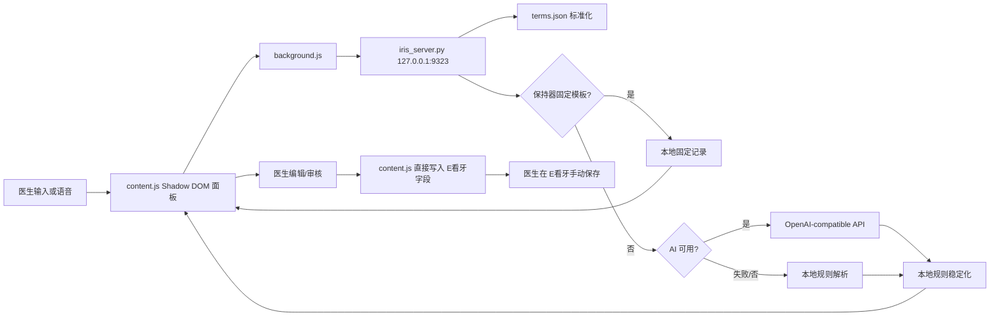
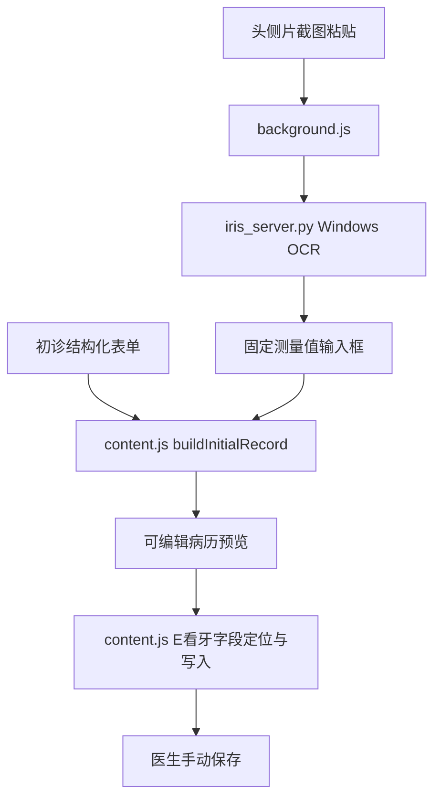

# 架构与数据流

## 模块

| 模块 | 文件 | 实际职责 |
| --- | --- | --- |
| 启动器 | `Run-Iris.cmd`, `Start-Iris.ps1` | 导入用户级 AI 环境变量、启动本地服务、可选调用 E看牙登录脚本。 |
| 本地服务 | `iris_server.py` | HTTP API、本地规则、AI 调用、头侧片 AI 视觉识别、术语读写、CDP 辅助接口。 |
| 扩展后台 | `chrome-extension/background.js` | 在内容脚本与 `127.0.0.1:9323` 之间转发生成、OCR、术语请求。 |
| 内容脚本 | `chrome-extension/content.js` | 创建 Shadow DOM 浮窗、初诊模板、复诊 UI、语音、E看牙字段识别/填入、历史病历解析。 |
| 样式 | `chrome-extension/panel.css` | Iris 面板和初诊模板的隔离样式。 |
| 扩展声明 | `chrome-extension/manifest.json` | 仅注入 `myourhis.myourchina.cn`，并允许访问本机服务。 |
| 术语 | `terms.json` | 口语到书面表达的可编辑映射。 |
| E看牙本机依赖 | `../EKanYa AutoLogin` | 专用 Chrome、登录态和 CDP 调试端口；不属于本仓库。 |

## 复诊数据流

服务端 `/api/generate` 返回记录对象。AI 仅产生 `examination`、`treatment`、`advice` 和 `flags`；本地规则可覆盖这些字段，以保护固定模板和临床分类规则。

## 初诊数据流

初诊主体不调用 AI；它在扩展中根据表单值生成记录。OCR 仅提供可编辑的数值建议。

## E看牙交互

1. `content.js` 注入到 E看牙页面，排除登录页显示。
2. 文本框定位优先按固定顺序与行标签（如“口腔检查”“处置”“医嘱”）查找，再使用较宽泛后备策略。
3. 初诊会分别填充主诉、现病史、既往史、检查、辅助检查、诊断、计划、处置、医嘱。
4. 普通复诊会填充默认基础字段、检查、处置和医嘱，并遍历右侧历史栏尝试复制既往正畸复诊的诊断/计划。
5. 所有写入由浏览器端 `setValue` 触发 `input`、`change`、`keyup`、`blur` 事件。代码不在扩展 UI 中点击保存。

## 服务 API

| 方法 | 路径 | 调用者 | 作用 |
| --- | --- | --- | --- |
| GET | `/api/health` | 后台/启动器 | 健康检查。 |
| GET/POST | `/api/terms` | 无 UI 调用（遗留） | 读取或更新术语映射；当前通过直接编辑 `terms.json` 维护。 |
| POST | `/api/generate` | 扩展后台 | 复诊生成。 |
| POST | `/api/ceph-ocr` | 扩展后台 | 头侧片截图 AI 视觉识别（失败重试并显式报错）。 |
| POST | `/api/fill` | 当前扩展未调用 | 服务端 CDP 后备填入接口；保留为历史/辅助能力。 |
| POST | `/api/confirm-save` | 当前扩展未调用 | 服务端有确认后点击保存的实现；因临床边界，不能在 UI 中启用。 |

## 本地状态与配置

- `chrome.storage.local`：本地服务地址、悬浮按钮位置、面板位置。
- `terms.json`：会被术语 API 直接覆盖写回，修改时需并发注意。
- Windows 用户环境变量：AI 密钥和模型设置。
- `../EKanYa AutoLogin/config.json`：本机 URL、端口与 Chrome 配置；不在 Iris 仓库内。
- `../EKanYa AutoLogin/chrome-profile`：浏览器登录态/凭据/站点数据；绝不能提交。

## 敏感点与修改风险

- `fillEkanya`、`findEkanyaEmrFields` 和历史栏遍历：外站 DOM 强耦合，风险最高。
- `local_generate` 与解析辅助函数：大量规则互相影响，改动须以代表句验证。
- `recover_ceph_value`：当前按截图几何布局做补偿，跨版式可靠性未知。
- `manifest.json` 和 `background.js`：权限、host 与本机通信边界。
